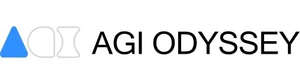

# A Dataset for The Global Artificial Intelligence Championship Math 2024


Report: [MathOdyssey: Benchmarking Mathematical Problem-Solving Skills in Large Language Models Using Odyssey Math Data](https://arxiv.org/abs/2406.18321).

* If you use our data, you may refer to it as "MathOdyssey" and provide the proper citation. Thanks.

The Global Artificial Intelligence Championship(GAIC) Math 2024 presents a collection of 387 meticulously crafted math problems, meticulously curated by professional math problem writers from both universities and high schools. The compilation includes high school competition questions with 148 problems, followed by a series of 138 high school mathematics questions, and concluding with 101 university-level mathematics questions. 

The GAIC Math 2024 problem setters are composed of mathematics professors hailing from esteemed institutions such as Arizona State University, Johns Hopkins University, Drexel University, National University of Singapore, Tsinghua University, and Central China Normal University. These professors were formally invited by AGI Odyssey to contribute their expertise to the competition. The problem setter committee aligned with the mission of AGI Odyssey, which aims to advance innovative research in artificial general intelligence (AGI) and foster interdisciplinary collaboration, and ensure that AGI development benefits humanity as a whole. To maintain the integrity and fairness of the competition, the problem setter committee ensured that all problems were original and kept confidential. Responsibilities of the problem setter committee included problem generation, review, formatting, testing, and revisions for GAIC Math 2024.


A new dataset of 387 questions and solutions from high school competition questions, high school mathematics questions, and university-level mathematics questions.


| ID |  Level                                     | Label                                              | Number   | 
|----|-------------------------------------------|----------------------------------------------------|----------|
| 1  | high school competition                   | Algebra                                            | 82       | 
| 2  | high school competition                   | NumberTheory                                       | 4        | 
| 3  | high school competition                   | Geometry                                           | 25       | 
| 4  | high school competition                   | Combinatorics                                      | 37       | 
| 5  | high school mathematics questions         | Algebra                                            | 69       | 
| 6  | high school mathematics questions         | Geometry                                           | 14       | 
| 7  | high school mathematics questions         | PreCalculus                                        | 47       | 
| 8  | high school mathematics questions         | Trigonometry                                       | 2        | 
| 9  | high school mathematics questions         | Calculus                                           | 5        | 
| 10 | high school mathematics questions         | Series                                             | 1        | 
| 11 | university-level                          | Linear Algebra and Abstract Algebra                | 25       | 
| 12 | university-level                          | Calculus and Analysis                              | 24       | 
| 13 | university-level                          | Differential Equations                             | 14       | 
| 14 | university-level                          | Probability                                        | 21       | 
| 15 | university-level                          | Statistics                                         | 17       | 

## Evaluation Baseline

Evaluation Results of Odyssey-Math dataset across different models.


## News

🌟 The GAIC competition was scheduled to commence on March 16, 2024, at 12:00 AM US Eastern Standard Time (EST). The competition ended by 11:59 PM US Eastern Standard Time (EST) on March 16, 2024.

## Quick Tour

To duplicate the baseline evaluation result, we provide the tutorials.

To generate the response using gpt4.
```python
python generate_response.py
```

To generate the response using llama or dbrx.
```python
python generate_with_llama.py
python generate_with_dbrx.py
```
Please note that the api_url may be subject to change over time, you can find the newest on [power.netmind.ai](https://power.netmind.ai/inference).

To clean the generated answer.
```python
cd jsonl
python process.py
```

To compare with the ground-truth data:
```python
python evaluate_response.py
```

Finally, in the visualize.ipynb, you can check the final accuracy.


## ​​Acknowledgement

We would like to extend our sincere gratitude to AGI Odyssey, the non-profit organization (NPO) responsible for organizing the Global Artificial Intelligence Championships (GAIC) Math 2024. Their dedication and commitment to promoting artificial intelligence education and innovation have been invaluable to the success of this project. Additionally, we appreciate their contribution of resources and support, which have played a significant role in making this initiative possible.

## Citation

Please cite the following:
```
@article{fang2024mathodyssey,
  title={MathOdyssey: Benchmarking Mathematical Problem-Solving Skills in Large Language Models Using Odyssey Math Data}, 
  author={Fang, Meng and Wan, Xiangpeng and Lu, Fei and Xing, Fei and Zou, Kai},
  journal={arXiv preprint arXiv:2406.18321},
  year={2024}
}
```

## 📜 License

The new contributions to our dataset are distributed under the [CC BY-SA 4.0](https://creativecommons.org/licenses/by-sa/4.0/) license, including

- The creation of the dataset;
- The filtering and cleaning of source datasets;
- The standard formalization of instances for evaluation purposes;
- The annotations of metadata.

The copyright of the images and the questions belongs to the original authors. Alongside this license, the following conditions apply:

- **Purpose:** The dataset was primarily designed for use as a test set.
- **Commercial Use:** The dataset can be used commercially as a test set, but using it as a training set is prohibited. By accessing or using this dataset, you acknowledge and agree to abide by these terms in conjunction with the [CC BY-SA 4.0](https://creativecommons.org/licenses/by-sa/4.0/) license.
